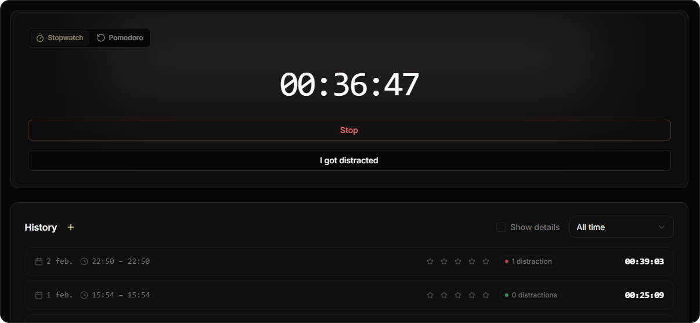

# Boosted Flow

Boosted Flow is a personal time tracker I built for focused work.

Live product: [boosted-flow.com](https://boosted-flow.com/)

Most trackers are built for teams, reporting, billing, and oversight. I wanted something much simpler: pick an activity, start a timer, stay focused, log distractions, leave a short reflection, and look back later to see patterns. Boosted Flow is that product. This repo is the React frontend.

## Product Preview



## What It Does

- Track time against named activities instead of a single generic timer.
- Let you switch between stopwatch and pomodoro depending on the kind of work.
- Capture intention before a session, then reflection, rating, and distraction count after it.
- Review recent history with filters, manual entry creation, and in-place editing.
- Show patterns through a GitHub-style heatmap, streak logic, activity breakdowns, peak-hour analytics, and CSV export.
- Keep common actions fast with a command palette, global hotkeys, and contextual keyboard shortcuts.
- Share completed sessions as PNG cards or Markdown.

## System Architecture

Boosted Flow is split into two parts: this frontend and a separate backend API.

```text
Frontend (this repo)
- React 19 + TypeScript
- TanStack Router / Query
- Tailwind CSS v4 + Radix UI
- Product UI, timer flows, analytics UI, keyboard interactions

Backend (separate repo)
- NestJS + Drizzle ORM
- JWT auth + refresh-cookie sessions
- Google OAuth, password reset, Turnstile-protected auth
- Activities, time-entry persistence, email flows, health checks
```

A few implementation details I cared about:

- Timer start is optimistic, so a session appears live immediately instead of waiting for the network round trip.
- Session restoration happens before protected routes render, which avoids the usual flash of logged-out UI.
- Pomodoro mode sits on top of the same time-entry model as standard tracking, so both modes stay consistent without creating a second tracking system.
- Analytics are derived client-side from time-entry data, keeping the backend focused on validation, auth, and persistence.

## Technical Highlights

- Optimistic timer start with cache reconciliation after the server response, including handling server/client timestamp drift.
- In-memory access tokens paired with HttpOnly refresh cookies, plus session restore on app boot.
- Google OAuth, forgot password, reset password, and Cloudflare Turnstile protection across auth flows.
- Context-aware command palette and hotkey system for navigation and timer actions.
- Editable session history with ratings, reflections, distractions, date filtering, manual entries, export, and sharing.
- Tests focus on the logic most likely to break: auth guards and store behavior, API client refresh logic, analytics utilities, heatmap and streak calculations, pomodoro state, and command palette behavior.

## Stack

Frontend: React 19, TypeScript, TanStack Router, TanStack Query, Tailwind CSS v4, Radix UI, React Hook Form, Zod, cmdk, Vitest, MSW.

Backend: NestJS, Drizzle ORM, libSQL, Passport/JWT, Google OAuth, Cloudflare Turnstile, transactional email flows.

## Role

I designed and built Boosted Flow as a solo engineer/designer, covering product UX, frontend implementation, and the system architecture behind the app.
